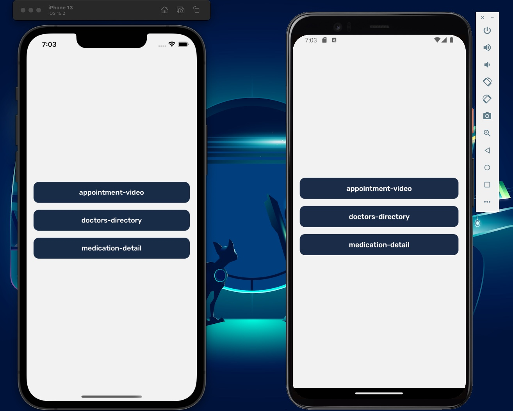
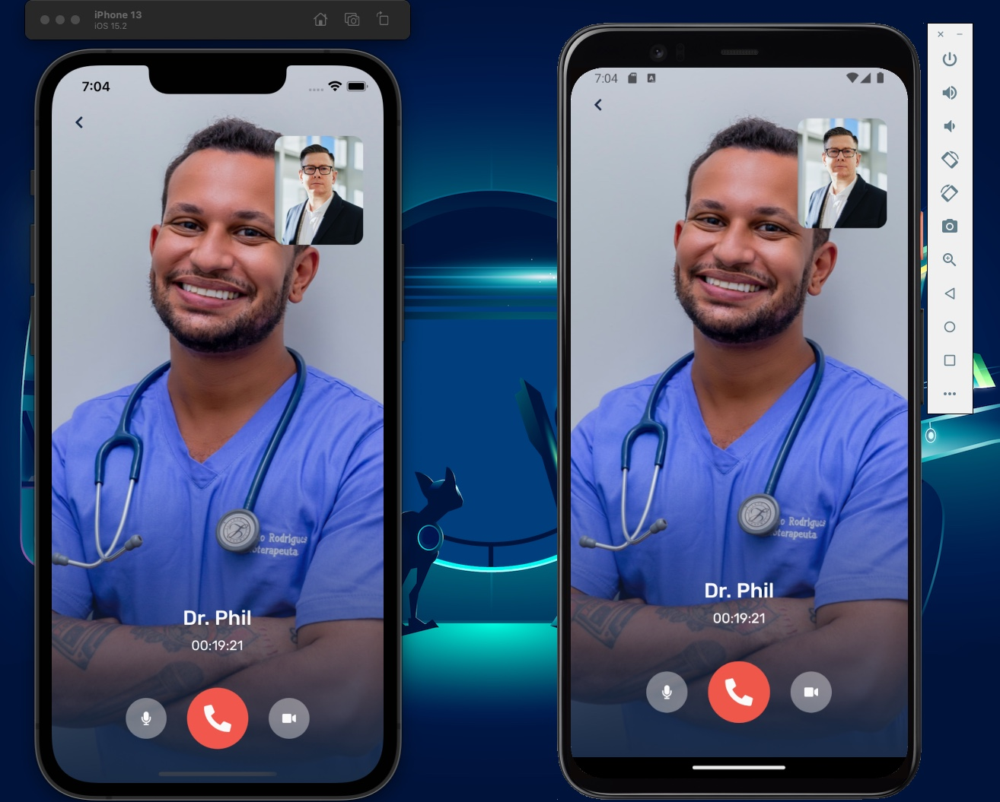
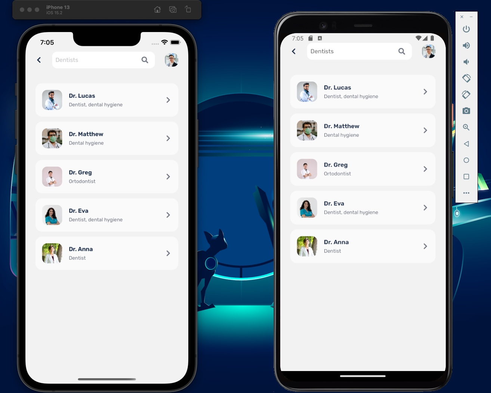
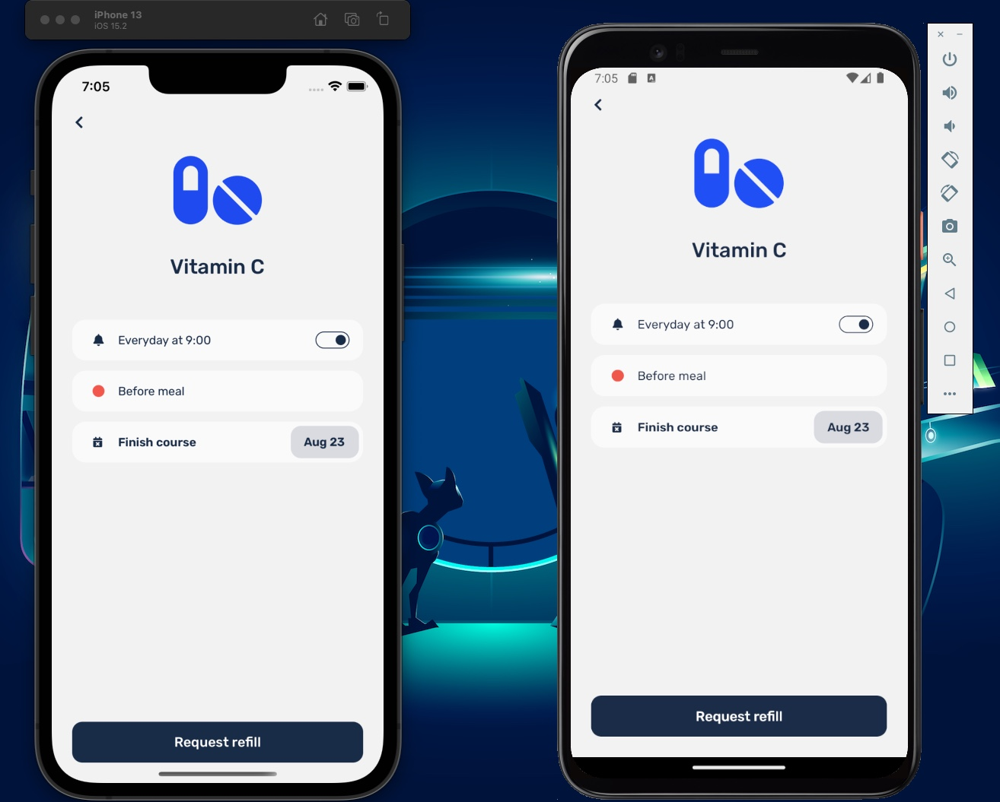

# Medical Demo App






- Welcome to the simple medical App with Expo, TypeScript, TailwindCSS (NativeWind)!
- This is a simple web application where you can find out a good structure when using Expo beside Tailwind.
- Video demo: https://youtu.be/ELUo8Xf7gIw?si=QtVsvd1c1u0ACm1f
- Please give this source a star, thank you so much 🥰.

## Installation

To run this project locally, follow these steps:

1. Clone the repository or download the source code.
2. Navigate to the project directory.
3. Install the dependencies using yarn:

```shell
yarn install
```

## Usage

To start the development server, use the following command:

```shell
yarn start
```

Checkout Expo documentation: https://docs.expo.dev/
